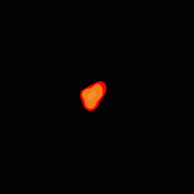
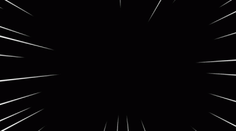
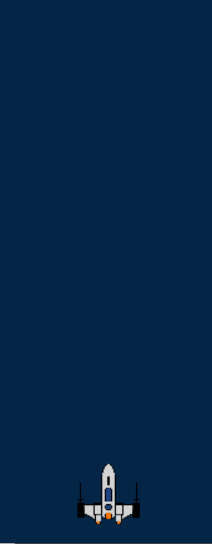

## Jeu Space Invaders
Jeu réalisé dans le cadre du cours de méthodologie de la programmation niveau 2 à l'Université de Lorraine. 

## Gamelay
<p align="center">
    
</p>

## But du jeu
Le but du jeu est de finir le niveau le plus rapidement possible, vous pouvez vous déplacer (Z, Q, ,S, D), tirer sur les météorite avec espace.
## Installation
Pour installer le jeu, il suffit de cloner le dépôt git et d'ecrire make dans le terminal puis lancer ./space_invaders.

## Doc 
Pour générer la documentation, il suffit d'écrire ```make doc``` dans le terminal. Si ca marque 'doc' is up to date, il faut lancer ```make -B doc```

## Génération de la map
La map est générée aléatoirement grace à un bruit de perlin qui nous permet de faire une carte qui se ressemble mais qui est toujours differente. Pour générer une map, il faut lancer ```make map``` dans le terminal.
En ce qui concerne les paramètres du bruit de perlin, on les a choisi en faisant des tests sur le logiciel de FastNoiseLite.
On utilise une librairie qui s'appelle [FastNoiseLite](include/FastNoiseLite.h) pour générer la map. 
On peut modifier la taille de la map dans le fichier [const.c](include/const.h) (ligne 55). Attention de bien make map et make avant de relancer le jeu.

### Exemple de carte :
<p align="center">
    
</p>


## Les deplacements
Le vaisseau se déplace de gauche à droite. Il peut se déplacer en restant appuyé D (droite) ou Q (gauche). On peut aussi accélérer le vaisseau en appuyant sur Z et ralentir en appuyant sur S. 

### Exemple de déplacement :
<p align="center">
    
</p>

## Animations
Nous avons crée un sytème n'animation [animate](include/animate.h)   qui permet de crée des animations grace à plusieur image qui s'affiche les unes après les autres. 

### Exemple de l'animation d'explotion:
<p align="center">
    
</p>

### Exemple de l'animation de vitesse :
<p align="center">
    
</p>


## Les scores
Les scores sont sauvegarder dans un fichier txt, ils sont écrit à chaque fin de jeu et on peut voir les meilleurs à la fin du jeu.
## Menu et ecran de fin
Pour le menu et l'écran de fin nous avons fait deux modules qui fonctionne comme le main mais qui sont plus simple. Nous avons fait un menu qui permet de choisir entre jouer et quitter. Nous avons aussi fait un écran de fin qui permet de rejouer ou de quitter, on peut aussi voir les meilleurs scores.

## Projectiles
Nous pouvons tirer plusieur projectiles d'un coup mais il y a un cooldown qui permet de ne pas tirer trop de projectiles en même temps. Les projectiles sont détruit quand ils touchent un ennemi ou quand ils sortent de la map. Il y'a aussi une legere variation de droite à gauche pour donner un effet de distortion.

### Exemple de tir:
<p align="center">
    
</p>

## Les sons
Nous avons ajouté des sons pour les tirs et les clics. Nous avons aussi ajouté de la musique de fond.
Pour régler le volume de la musique de fond, il faut modifier la variable ```MUSIC_VOLUME``` pour la musique ou ```SOUND_VOLUME``` pour les sons dans le fichier [const.c](include/const.h) (ligne 65 et 70).

## Tests
Une très grande partie du code a été testé pour lancer les tests, il faut lancer ```make test``` dans le terminal.
## Crédits
Ce projet a été réalisé par Matthieu Gaudel et Gabin Colin, étudiants en L1 Informatique à l'Université de Lorraine.